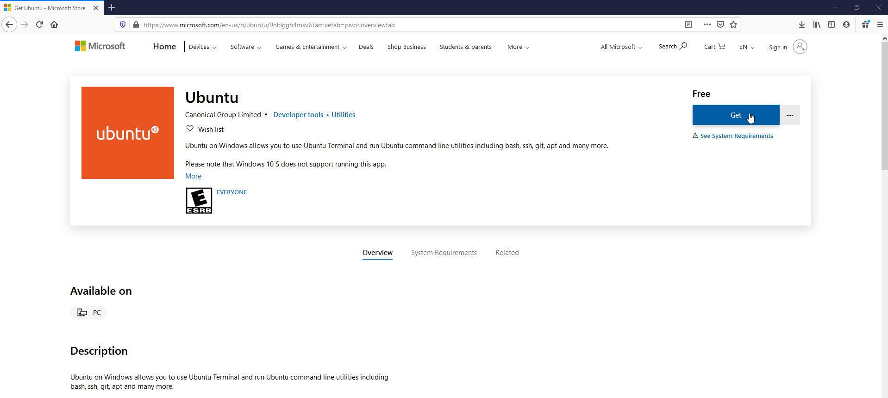

# System Setup

*Setting up a development environment for your machine*

***Author: [Ken King](https://github.com/kking935/)***

---

## Setting Up WSL (Windows Users ONLY!)

***Note: If your computer is running on a Mac or Linux operating system, you can skip this section and move on to the Visual Studio Code section of this tutorial.***

&nbsp;
If you are using a computer running on Windows 10, we'll want to take advantage of the Windows System for Linux (WSL) to run an Ubuntu sub-system on your PC. This will will give you access to a ton of great UNIX commands not available in Window's native OS. *These instructions were derived from [Microsoft's WLS docs](https://docs.microsoft.com/en-us/windows/wsl/install-win10#install-your-linux-distribution-of-choice). If at any point you run into issues not outlined in this tutorial, you may find their docs are a helpful resource for troubleshooting*

1. Start by running the Windows PowerShell as an administrator. To do this, navigate to the Windows Search Bar (typically in the bottom left corner of the screen) and type in `Windows PowerShell`.
&nbsp;

&nbsp;

2. Right click on the application and select `Run as Administrator`.
&nbsp;

&nbsp;

3. After prompting you to enter the Admin password, a blue window like this one should appear on your screen.
&nbsp;

&nbsp;

4. Copy and paste the following command into this window, and then hit the ENTER key to run the command:
&nbsp;

    ```bash
    dism.exe /online /enable-feature /featurename:Microsoft-Windows-Subsystem-Linux /all /norestart
    ```
    
    If everything works as expected, you should receive an output message like this one:
    &nbsp;
    
    &nbsp;

5. At this point, you should restart your machine for the changes to take effect.
&nbsp;

6. Upon restarting your computer, navigate to the [Ubuntu app in the Microsoft Store](https://www.microsoft.com/en-us/p/ubuntu/9nblggh4msv6) and click the blue 'Get' button.
&nbsp;

&nbsp;

7. This should open the same view as before on the Microsoft Store website, but in the Microsoft Store desktop app.
&nbsp;

&nbsp;
Your screen may look slightly different than mine since I have already installed Ubuntu to my Windows machine, but regardless just click the install button to download the Ubuntu app to your computer.
&nbsp;

8. Once the installation process is complete, click on the blue 'Launch' button to start Ubuntu.
&nbsp;

&nbsp;

9. Again since I already have Ubuntu set up on my Windows machine I cannot show the exact view you should see on your screen (my bad). However, a black window should appear on your screen (similar to the image below), and after a short boot-up process it should prompt you to create a Username and Password for your Ubuntu user profile. After entering this information, you should be all set to get started using Ubuntu on a Windows machine!
&nbsp;

&nbsp;

---

## Visual Studio Code

1. Start by downloading Visual Studio Code for [your operating system](https://code.visualstudio.com/download).
    &nbsp;
    
    &nbsp;

2. Once Visual Studio Code is installed, launch the application.
    &nbsp;
    
    &nbsp;
    You should see a view very similar to this one, if not the exact same. For now we'll only focus on the VS Code features that we need for tutorial, but if you want to learn more about this layout you can [learn more here!](https://code.visualstudio.com/docs/getstarted/userinterface)
    &nbsp;

3. Click on the `Terminal` tab on the top menu and select `New Terminal`.
    &nbsp;
    
    &nbsp;
    You should see a new window pop up at the bottom of your screen.
    &nbsp;
    
    &nbsp;

    The ***terminal*** is a tool we can use to talk directly to our computer so we can give it specific ***commands*** to execute. For any action you can make your computer do with the click of a mouse, there exists a command that you can enter into the terminal that will do the same thing. In fact, many actions you can make your computer do with the click of a mouse rely on terminal commands behind-the-scenes to tell the computer what to do. There is a near-infinite number of *incredibly* powerful commands your computer can execute, and for almost all of them there doesn't and <ins>will never</ins> exist some sort of 'convenient button' or 'dropdown setting' in your computer that you can just click to do this stuff for you. Plain and simple, if you want to push the boundaries of technological innovation and creativity, you have to study these commands and **learn how to talk to the computer.**
    &nbsp;

4. ***If you're on a Mac or Linux machine, you can skip this step.*** If you are on a Windows machine running Ubuntu via WSL, we'll want to configure VS Code to launch an Ubuntu terminal instead of a PowerShell terminal. To do this, you'll first need to install VS Code Server. This can be done by opening the Ubuntu applicaton and entering this command: 
&nbsp;

  ```bash
  code
  ```
  
  After the installation is complete, navigate back to your VS Code window, click on the terminal dropdown arrow and click `Select Default Shell`.
    &nbsp;
    
    &nbsp;
    A dropdown list with the different shell options should appear at the top of you VS Code window. From this list, select `WSL Bash`.
    &nbsp;
    
    &nbsp;
    You'll need to open a new terminal for these updates to take effect. To do this repeat step 3, or alternatively you can click on the `+` button to the right       of the dropdown.

***HINT***
If you're on Mac OS and it is saying that the command 'code' is not found, try the first answer from [this stackoverflow post](https://stackoverflow.com/questions/29955500/code-not-working-in-command-line-for-visual-studio-code-on-osx-mac). If that doesn't work for you, contanct me.

---

## Installing HomeBrew

Now that we have access to a terminal window (through VS Code), we can now use commands to install the rest of the tools we need. For starters, we'll download a tool called [HomeBrew](https://brew.sh/) that will help manage all of our software installations.
&nbsp;

1. To install HomeBrew on Mac, WSL, and Linux alike, run this command:
&nbsp;

    ```bash
    /bin/bash -c "$(curl -fsSL https://raw.githubusercontent.com/Homebrew/install/master/install.sh)"
    ```

    &nbsp;

2. ***If you're on a Mac OS you can skip this step.*** If you are on a Linux machine or running Linux on Windows via WSL, you'll also need to run the following commands (you can just copy and paste the whole thing):
&nbsp;

    ```bash
    test -d ~/.linuxbrew && eval $(~/.linuxbrew/bin/brew shellenv)
    test -d /home/linuxbrew/.linuxbrew && eval $(/home/linuxbrew/.linuxbrew/bin/brew shellenv)
    test -r ~/.bash_profile && echo "eval \$($(brew --prefix)/bin/brew shellenv)" >>~/.bash_profile
    echo "eval \$($(brew --prefix)/bin/brew shellenv)" >>~/.profile
    ```

    &nbsp;

3. At this point, HomeBrew should be ready to go. To test that everything is set up correctly, run this test command:
&nbsp;

    ```bash
    brew install hello
    ```

    If you receive any error messages from this command, something is wrong. First make sure that you followed this tutorial EXACTLY as specified, and if you still have issues [here's a good resource to start troubleshooting](https://google.com).
    &nbsp;

---

## Installing GCC

HomeBrew relies on the `gcc` command, so we'll need to install that before we do anything else:
&nbsp;

1. Run this command to install gcc (lemme also just take a second to point out how dang simple that install command is, all thanks to HomeBrew!)
&nbsp;

    ```bash
    brew install gcc
    ```

2. To confirm that gcc was installed correctly, this command should output gcc's version number:
&nbsp;

    ```bash
    gcc --version
    ```

    &nbsp;

---

## Installing MongoDB

Our backend needs a database to store data to. We will use MongoDB, which is a very popular 'NoSQL' database. To configure MongoDB on your machine:

***If you are on Mac or Linux***
1. Install MongoDB using HomeBrew
&nbsp;

    ```bash
    brew tap mongodb/brew
    brew install mongodb-community@4.4
    ```
    
***If you are on Windows***
1. Go to https://docs.mongodb.com/manual/tutorial/install-mongodb-on-windows/ and follow the steps there.
2. Since mongo is not supported on WSL yet, we need to add the path to the mongo bin directory to our WSL path. Enter the following into your WSL terminal:
    ```bash
    export PATH="/mnt/c/Program\ Files/MongoDB/Server/4.4/bin"
    ```
    *Note: If you installed mongodb to a drive other than your c drive, replace the c above with which ever drive letter you are using.*
3. Ensure that it is working by entering `mongo.exe` into your shell. If the mongo shell opens up it worked. 
4. You're now all set up to use mongo/mongod in WSL, however, it's kinda annoying having to call it with the '.exe' ending. If you want to be able execute these programs with out the file extension, enter the following into your .bashrc file in your home directory:
    ```bash
    alias mongo="mongo.exe"
    alias mongod="mongod.exe"
    ```
You can now use mongodb without the '.exe' ending. 

2. To confirm that MongoDB was installed correctly, try manually firing it up:
&nbsp;

    ```bash
    # Linux or WSL
    mongod --config /home/linuxbrew/.linuxbrew/etc/mongod.conf

    # Mac
    mongod --config /usr/local/etc/mongod.conf --fork
    ```

    &nbsp;

    After running the above command, you should be able to start a mongo shell with the following command:

    &nbsp;

    ```bash
    mongo
    ```

    &nbsp;

    To see all of the MongoDB databases on your machine, enter this command into the shell:

    &nbsp;

    ```SQL
    show dbs
    ```

    &nbsp;

    For now, you should just have one database called 'Admin'.

## Installing Git

Git is a very useful tool we can use to share and manage code across our team. We won't dive too deep into the details of Git for now, but just know we will definitely be talking about Git in increasingly greater detail as we progress.

1. To install Git via HomeBrew:
&nbsp;

    ```bash
    brew install git
    ```

    &nbsp;

2. To confirm that Git was successfully installed, run:
&nbsp;

    ```bash
    git --version
    ```

    Ideally, your version number should be 2.22 or higher, but if it's less than that we shouldn't need to worry about it too much for now.
    &nbsp;

3. Its a good practice to store all of your git folders in the same place, so let's make a folder specifically for code we download using git. Navigate to your home directory using the `cd` command (stands for 'change directory'), paired with the `~` character, which represents the home directory.
&nbsp;

    ```bash
    cd ~
    ```

    &nbsp;

4. Now that we're in the home directory, this is a good place to create our git directory. We can make a directory inside our current *working directory* (the directory your terminal is currently looking in) using the `mkdir` command:
&nbsp;

    ```bash
    mkdir git
    ```

    &nbsp;

5. Again, use the `cd` command to move into the newly created git directory.
&nbsp;

    ```bash
    cd git
    ```

    &nbsp;

With all of our needed packages installed and proper place to store our git repositories on our local machines, we're now ready to jump into the fun stuff, code!
&nbsp;

---

## Installing a Vector Rideshare Repository

Using Git, we can download Vector Rideshare's code repositories to our machine. To do this, we use the command `git clone` followed by the URL to the repository that we want to download (with .git added to the end of the URL to specify the location of the *repository* rather than the location of the *webpage* we use to *view* the repository). This command should be pretty intuitive, we're literally 'getting' a 'clone' (aka a duplicate copy) of the repository located at the specified URL.

1. For this tutorial, we'll be working with this exact repository.
&nbsp;

    ```bash
    git clone https://github.com/VectorRideshare/System-Setup.git
    ```

    If this is your first time running git on this machine, it will likely ask you for your GitHub username and password. After entering your credentials, the installation process should finish very quickly.

    &nbsp;

2. To confirm that the clone was successful, we'll use the `ls` command to view all of the files in our working directory:
&nbsp;

    ```bash
    ls
    ```

    The only output you should see is a directory called `System-Setup` (any time you clone a repository, the code is saved in a directory with the same name as the repository it was cloned from)
    &nbsp;

3. Now that the repository is successfully cloned to your computer, let's open it in VS Code. While you could open VS Code manually and navigate to the System-Setup directory, there's an even faster (and pleasantly lazier) way of doing this. By using the `code` command followed by a file or directory, we can instantly launch a VS Code window inside that directory.
&nbsp;

    ```bash
    code System-Setup/
    ```

    If everything works as expected, you should see a new VS Code window pop up, and if you check the Explorer tab you should see that we are indeed inside the System-Setup directory.
    &nbsp;
    
---

## Next Steps

This is a good break point for now. If you followed this tutorial all the way through, congrats! You now have a very powerful, yet very simplistic software development environment that can be used by beginners and pros alike.
With all of this maintenance work out of the way, we're finally ready to start getting our hands dirty with some code. More specifically, next we'll talk about Node.JS and the basics of the backend.

## Introduction to the Backend

In this section of the tutorial, we will be talking about the basics of how to build a backend server. In our case, we will be using Node.JS to build simple, lightweight, yet powerful servers.

### Node.JS

[Node.JS](https://nodejs.org) is an open-source, cross-platform JavaScript runtime environment that allows for the execution of JavaScript code outside of a web browser. In short, it allows us to build servers in JavaScript that can run on a computer in the cloud. This is very convenient because it means that we can build both our frontend website and our backend server entirely in JavaScript.

### Installing Required Packages

1. Before you can run the Vector Recruits backend, you'll need to install node and the node package manager (npm) using HomeBrew. This command will install both for you:

    ```bash
    brew install node
    ```

2. We'll also want to install yarn, another package manager.

    ```bash
    brew install yarn
    ```

3. To confirm that the installation was successful, check the version numbers:

    ```bash
    node --version
    npm --version
    yarn --version
    ```

### Running the Node Server

With node and npm installed, we're finally ready to launch the server!

1. With VS Code open and inside your local copy of the System-Setup repository, enter the following command in the terminal to navigate to the `UniDash-Backend` directory:

    ```bash
    cd UniDash-Backend/
    ```

2. With the terminal path inside the backend directory, enter the following command to install all of the required backend dependencies:

    ```bash
    npm install
    ```

3. Finally, to start the server enter the following command:

    ```bash
    npm run dev
    ```

### Running the React App

1. To set up the frontend, start by opening a new terminal and navigating to the `UniDash-Frontend` directory

    ```bash
    cd UniDash-Frontend/
    ```

2. Inside the `UniDash-Frontend` directory, install all of the frontend dependencies

    ```bash
    yarn
    ```

3. With the frontend dependencies installed, the frontend is ready to go. To launch the webapp, run the following command:

    ```bash
    yarn start
    ```

With the backend up and running, the frontend should work perfectly.
